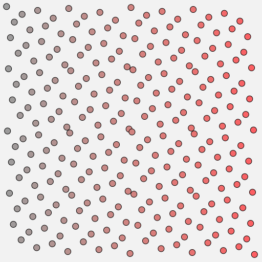

# hammersley



[](http://github.com/badges/stability-badges)

Computes i-th point in a Hammersley Point Set of size n

## Usage

[](https://www.npmjs.com/package/hammersley)

#### hammersley(i, n)

Parameters:  
`i` - index of sample which coordinates we want to calculate  
`n` - number of samples in the point set we are generating

Returns:  
`[x,y]` - i-th point from a Hammersley point set of size n, x and y are from 0..1

## Example

```javascript
var hammersley = require('hammersley');

for(var i=0; i<300; i++) {
    var p = hammersley(i, 300);
    //0 -> [ 0, 0 ]
    //1 -> [ 0.00333, 0.5 ]
    //2 -> [ 0.00666, 0.25 ]
    //3 -> [ 0.01, 0.75 ]
    //...
}
```

## See also

Based on [Hammersley Points on the Hemisphere](http://holger.dammertz.org/stuff/notes_HammersleyOnHemisphere.html) by Holger Dammertz [2012]

## License

MIT, see [LICENSE.md](http://github.com/vorg/hammersley/blob/master/LICENSE.md) for details.
