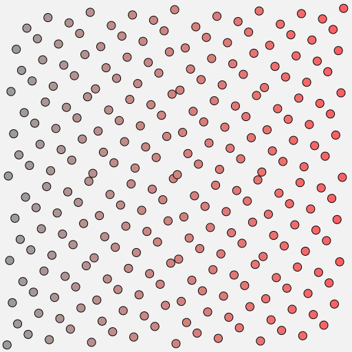

# hammersley

Computes i-th point in a Hammersley Point Set of size n.



## Installation

```bash
npm install hammersley
```

## Usage

```js
import hammersley from "hammersley";

for (let i = 0; i < 300; i++) {
  const p = hammersley(i, 300);
  // 0 -> [0, 0]
  // 1 -> [0.00333, 0.5]
  // 2 -> [0.00666, 0.25]
  // 3 -> [0.01, 0.75]
  // ...
}
```

#### `hammersley(i, n)`

**Parameters**

- `i` - index of sample which coordinates we want to calculate
- `n` - number of samples in the point set we are generating

**Returns**

`[x,y]` - i-th point from a Hammersley point set of size n, x and y are from 0..1

## See also

Based on [Hammersley Points on the Hemisphere](http://holger.dammertz.org/stuff/notes_HammersleyOnHemisphere.html) by Holger Dammertz [2012]

## License

MIT, see [LICENSE.md](http://github.com/vorg/hammersley/blob/master/LICENSE.md) for details.
